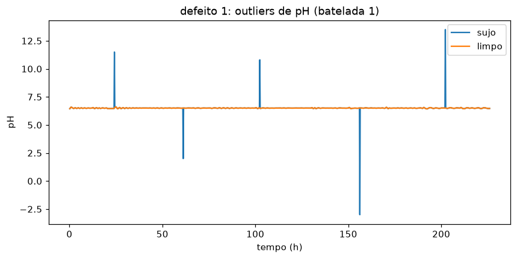
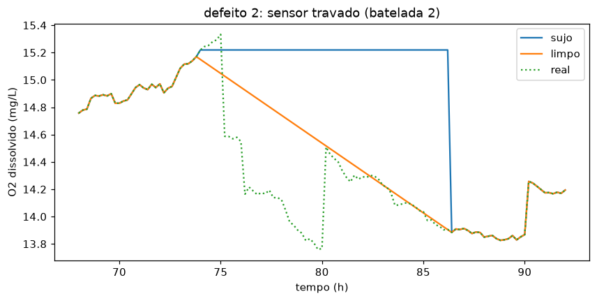
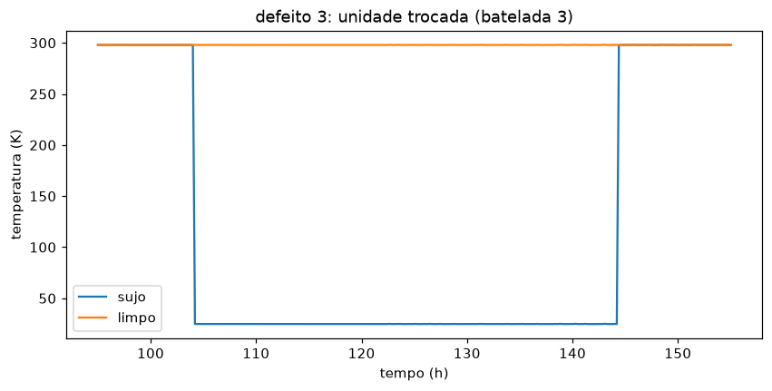
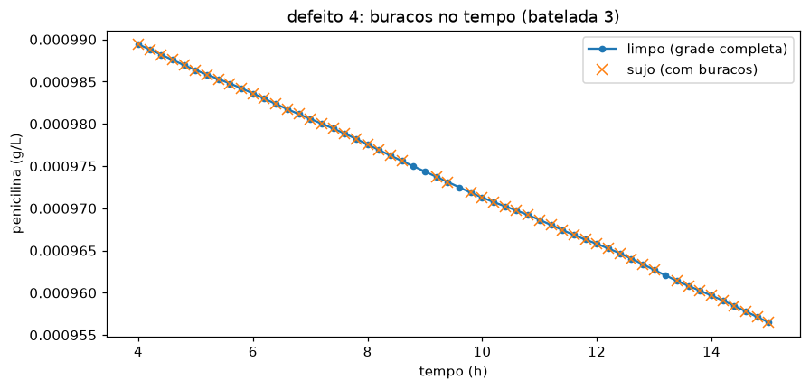

# P04. Pipeline de limpeza de dados de processo

**Nº 4 de 49 na ordem de execução.** ID do projeto: P04.

**Cursos da Alura a fazer antes deste projeto (todos os que caem aqui na ordem das 4 carreiras):**
- CD/N1-04 e 05 — Pandas: transformação e manipulação; limpeza e tratamento

Dado de sensor de processo quase nunca chega pronto pra usar. Vem com leitura fora da faixa
física, sensor travado repetindo o último valor, trecho gravado na unidade errada, buraco na
série quando a coleta cai. Este projeto constrói uma função de limpeza reutilizável que trata
esses quatro problemas de forma separada e documentada, e no fim mede o quanto a correção se
aproxima do valor verdadeiro.

## Os dados

*IndPenSim* (Industrial Penicillin Simulation), uma simulação de uma fermentação de penicilina
em escala industrial, tanque de 100 mil litros. É dado simulado, não medição de planta, mas o
modelo foi calibrado com dados históricos de uma fábrica real, então as curvas se comportam
como processo de verdade. Fonte: espelho no Kaggle, "Big Data-Biopharmaceutical manufacturing"
(stephengoldie).

O arquivo original tem 100 bateladas e 2.239 colunas, quase todas espectro Raman. Aqui uso só
as 37 colunas de processo (`pH`, `temperatura_K`, `oxigenio_dissolvido_mg_L`, vazões, volume,
peso, etc.) e as 3 primeiras bateladas, um recorte de 3.670 linhas. Os `.csv` não vão no
repositório (ver `.gitignore`).

Um problema já no dado bruto: a linha de cabeçalho tem duas colunas a mais que as linhas de
dados, porque um dos nomes de coluna tem vírgulas soltas no meio e o leitor de CSV quebra ele
em três. Isso desalinha todos os rótulos a partir dali. A primeira coisa que faço é ignorar o
cabeçalho do arquivo e nomear as 37 colunas na mão, pela posição.

## Os quatro defeitos

O IndPenSim é limpo. Pra ter com o que comparar, o notebook injeta os defeitos de propósito,
com posição e valor conhecidos. O dado limpo fica guardado como gabarito.

| Defeito | Onde | O que é |
|---|---|---|
| Outlier de sensor | pH, batelada 1 | 5 leituras trocadas por valores impossíveis (pH 11, pH -3) |
| Sensor travado | oxigênio dissolvido, batelada 2 | cerca de 12 h repetindo o último valor lido |
| Unidade trocada | temperatura, batelada 3 | um trecho gravado em Celsius (~25) em vez de Kelvin (~298) |
| Buraco no tempo | batelada 3 | 25 leituras removidas, a cadência de 0,2 h fica furada |

## A limpeza

Uma função por defeito, e uma função `limpa()` que chama as quatro na ordem certa. Os buracos
vêm por último, pra interpolação não passar por cima da sujeira que ainda não foi tratada.

- **Outlier**: marca o que cai fora de uma faixa física larga (pH de 5 a 8), troca por `NaN`,
  interpola. Não uso teste estatístico porque a faixa do processo é conhecida.
- **Sensor travado**: mede o comprimento de cada corrida de valores idênticos. Leitura de
  sensor com casa decimal quase nunca repete exata; corrida acima de 20 leituras é
  travamento. Vira `NaN`, interpola.
- **Unidade trocada**: temperatura abaixo de 200 não é Kelvin possível num fermentador. Soma
  273,15 de volta. Aqui não se perde informação, a conversão é exata e reversível.
- **Buraco no tempo**: pra cada batelada, reconstrói a grade de tempo completa de 0,2 em 0,2,
  encaixa os dados com `reindex` (o que cria linha vazia onde faltava leitura), e interpola
  essas linhas.

## Resultado

Rodando `limpa()` no dado sujo e comparando com o original, leitura a leitura:

| Coluna | Erro médio absoluto | Erro máximo |
|---|---|---|
| pH | 0,00001 | 0,005 |
| temperatura (K) | 0,0001 | 0,22 |
| oxigênio dissolvido (mg/L) | 0,005 | 0,80 |









## Limitações

A interpolação linear serve bem pra buraco curto e mal pra buraco longo. No sensor travado de
12 h (62 leituras seguidas) a limpeza troca a linha reta do valor congelado por uma rampa
reta, que também não é o que aconteceu de verdade. Quase todo o erro máximo de 0,8 mg/L está
nesse trecho. Pra esse caso, marcar o período como não confiável seria mais honesto que
interpolar.

Reconstruir as 25 linhas que sumiram é uma escolha, não um passo neutro. A alternativa é
deixar o buraco documentado e não inventar leitura. Fiz a reconstrução porque a sinopse do
projeto pede tratar "timestamp irregular", mas num caso real isso depende do que vem depois.

As interpolações rodam na coluna inteira, sem cortar por batelada. Só seria problema se um
defeito caísse exatamente na primeira ou última linha de uma batelada, o que não acontece
nesse recorte. Pra generalizar, cada função precisaria de um `groupby("batelada_id")` em
volta, como já é feito na função dos buracos.

## Como rodar

```bash
pip install pandas numpy matplotlib jupyter
# baixar o IndPenSim do Kaggle e por o CSV das 100 bateladas em data/
jupyter notebook notebooks/P04_pipeline_limpeza.ipynb
```

O notebook parte de `data/indpensim_processo.csv`, que é o recorte de 3 bateladas e 37 colunas
de processo. A célula de preparação mostra como esse recorte sai do arquivo bruto de 2,5 GB
(o `skiprows` + `usecols` + `names` que conserta o cabeçalho quebrado).

O próximo projeto do portfólio usa dados já limpos, pra visualização de variáveis de processo.
